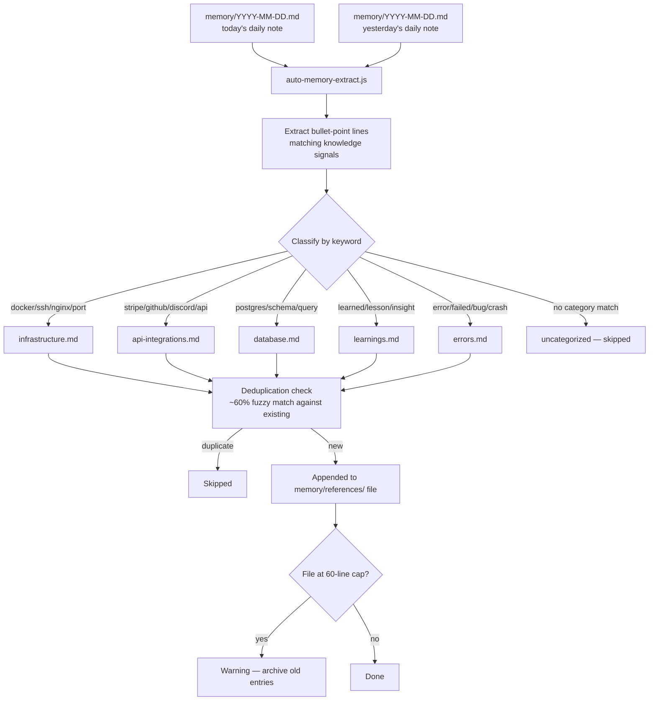
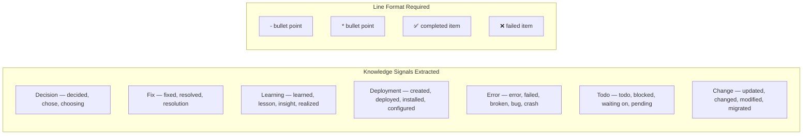

# auto-memory-extract — Long-Term Memory Extractor for AI Agents

Scans recent daily notes for decisions, learnings, errors, and facts, and consolidates them into categorized reference files — preventing knowledge from getting buried in chronological logs and never surfacing again.

> Part of [The Agent Crafting Table](https://github.com/Agent-Crafting-Table) — standalone agent system components for Claude Code.

## How It Works





## The Problem

Long-running agents write daily notes. Over time, those notes pile up and the agent has to read hundreds of lines of historical context to find one fact. This script bridges the gap: it scans the last two days of notes for structured knowledge signals (decisions made, errors fixed, things deployed) and moves them into topical reference files the agent can load on demand.

## Usage

```bash
# Dry run — shows what would be extracted, writes nothing
node auto-memory-extract.js --dry-run

# Live run
node auto-memory-extract.js
```

Typical output:

```
🧠 Auto-Memory Extraction
──────────────────────────────────────────────────
Found 14 candidate lines (9 today, 5 yesterday)

📊 Results: 3 new items to extract, 8 duplicates skipped, 3 uncategorized

  📝 infrastructure.md: +2 items
     - Fixed nginx 502 by increasing proxy_read_timeout to 300s
     - Deployed new container on port 8080 behind NPM proxy host
  📝 errors.md: +1 items
     - Error: nginx 502 when upstream takes >60s — fix: proxy_read_timeout

✅ Extraction complete.
```

## Setup

### 1. Define your daily note format

The script reads `memory/YYYY-MM-DD.md` (relative to the parent of where the script lives). Daily notes should use bullet points (`-` or `*`) for facts. Headers and fenced code blocks are skipped.

Example daily note snippet that would be extracted:
```markdown
- Fixed SSH connection drop by setting ServerAliveInterval 60
- Deployed auth service on port 3001
- Learned: always set HOME env var when spawning subprocesses in cron
- Error: ENOENT on claude binary — fixed by resolving PATH at startup
```

### 2. Customize CATEGORIES

Edit the `CATEGORIES` array at the top of the script to match your project's topics:

```javascript
const CATEGORIES = [
  { file: 'infrastructure.md', keywords: ['docker', 'ssh', 'nginx', 'port', 'server', 'container'] },
  { file: 'api-integrations.md', keywords: ['stripe', 'github', 'discord', 'webhook', 'api key'] },
  { file: 'database.md', keywords: ['postgres', 'mongodb', 'migration', 'schema', 'query'] },
  // Add your own topics here
];
```

Lines that don't match any category are counted as "uncategorized" and skipped — they stay in the daily note but aren't promoted to a reference file.

### 3. Set up reference file directory

The script writes to `memory/references/<file>` and `memory/learnings.md` / `memory/errors.md`. Create these dirs:

```bash
mkdir -p memory/references
```

Reference files are created automatically on first write.

### 4. Wire to a cron job

Run daily (e.g. 2am) after your agent has written its daily note:

```bash
# In cron-framework jobs.json:
{
  "id": "auto-memory-extract",
  "name": "Auto Memory Extract",
  "schedule": "0 2 * * *",
  "message": "Run node scripts/auto-memory-extract.js and reply HEARTBEAT_OK when done."
}
```

Or just run it manually at end of session:

```bash
node auto-memory-extract.js
```

## Requirements

- Node.js 16+
- Zero runtime dependencies
- Daily note files at `memory/YYYY-MM-DD.md` (path configurable via `WORKSPACE` constant)

## File Size Limits

Reference files are capped at 60 non-empty lines by default (configurable in `LIMITS`). When a file is at its limit, new items are dropped with a warning. This prevents reference files from growing unboundedly — when one fills up, it's a signal to archive older entries manually.

## Extraction Signals

Lines are extracted when they contain these patterns:

| Pattern | Examples |
|---|---|
| Decision | "decided", "chose", "choosing" |
| Fix | "fixed", "resolved", "resolution" |
| Learning | "learned", "lesson", "insight", "realized", "turns out" |
| Deployment | "created", "built", "deployed", "installed", "configured", "set up" |
| Error | "error", "failed", "broken", "bug", "crash" |
| Todo | "todo", "blocked", "waiting on", "pending" |
| Change | "updated", "changed", "modified", "migrated", "moved" |

Only lines that also start with `-`, `*`, `✅`, or `❌` are considered (i.e. structured bullet points, not prose paragraphs).

## Deduplication

Before adding a line, the script checks all existing lines in the target file. It normalizes both strings (lowercase, strip punctuation, first 60 chars) and checks positional character overlap. If >60% of chars match at the same positions, the line is considered a duplicate and skipped. This is intentionally fuzzy — slightly reworded duplicates are caught.

## Customizing Paths

The script uses `WORKSPACE = path.join(__dirname, '..')` — the parent of wherever you put the script. To change the memory directory layout, edit `MEMORY_DIR`, `REFS_DIR`, and the `CATEGORIES` `file` values at the top.
